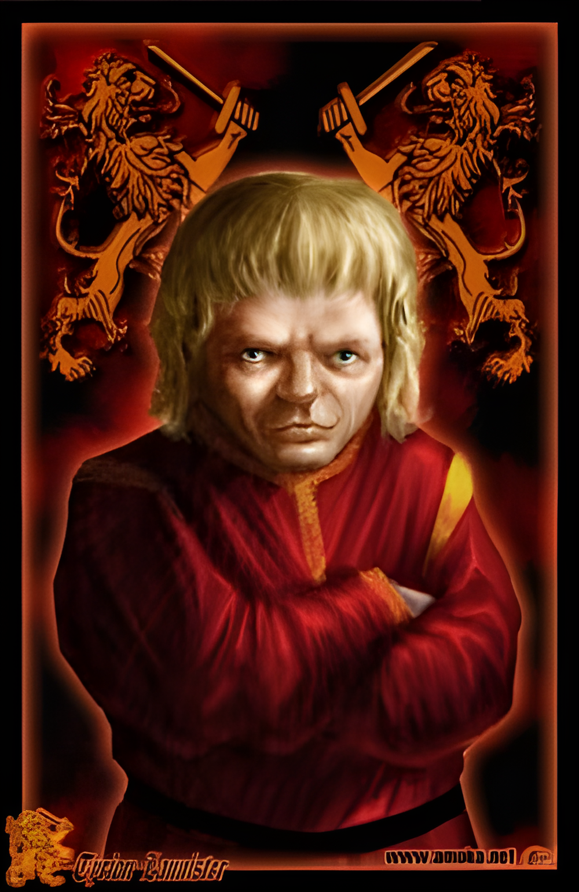
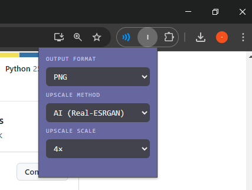
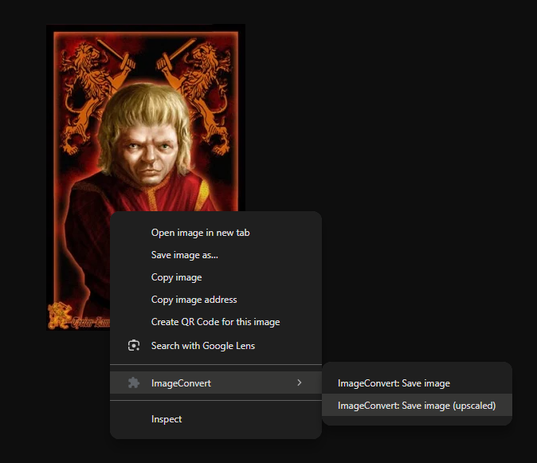

# ImageConvert

A Chrome extension for converting and downloading images in any format (PNG, JPEG, WebP) directly from the right-click menu. Supports bicubic, Lanczos, and AI-based upscaling.

---

## Motivation

I run a YouTube channel and regularly source images from the web for thumbnails and video assets. Images online come in all formats, and modern formats like WebP and AVIF are widely used but not supported by most video editors, meaning every image needs to be converted before it can be used. On top of that, sourcing low-resolution images is common, and existing upscaling services require you to download the image first, upload it to the service, wait, then download again. Many of these services are also paid. ImageConvert solves this by letting you convert and upscale any image directly from the right-click menu in one step, without leaving the browser.

---

## Preview (open images to see details better)

<table>
  <tr>
    <td align="center"><strong>Original</strong></td>
    <td align="center"><strong>Bicubic</strong></td>
  </tr>
  <tr>
    <td></td>
    <td></td>
  </tr>
  <tr>
    <td align="center"><strong>Lanczos</strong></td>
    <td align="center"><strong>AI (Real-ESRGAN)</strong></td>
  </tr>
  <tr>
    <td></td>
    <td></td>
  </tr>
</table>

---

## UI

<table><tr>
<td></td>
<td></td>
</tr></table>

---

## Project structure

```
imageConvert/
├── extension/       Chrome extension source files
├── server/          Local AI upscale server (Python)
├── tests/           Automated tests
├── package.json     JS test dependencies
└── jest.config.js   Jest configuration
```

---

## Installation

1. Clone or download this repository
2. Open Chrome and go to `chrome://extensions`
3. Enable **Developer mode** (top right)
4. Click **Load unpacked** and select the `extension/` subfolder

---

## AI Upscaling (optional)

The AI upscale option uses [Real-ESRGAN](https://github.com/xinntao/Real-ESRGAN) running locally on your machine. It requires Python and a one-time setup.

### Setup

1. Install dependencies:
   ```
   pip install -r server/requirements.txt
   ```

2. Start the server before using AI upscaling:
   ```
   python server/server.py
   ```
   The model weights (~64MB) will be downloaded automatically on first run.

3. In the extension popup, select **AI (Real-ESRGAN)** as the upscale method and right-click any image to use it.

> The server only runs locally and is not accessible from outside your machine.

---

## Usage

- **Right-click any image** → *ImageConvert: Save image*: converts and downloads at original size
- **Right-click any image** → *ImageConvert: Save image (upscaled)*: upscales using the method and scale factor selected in the extension settings popup

---
